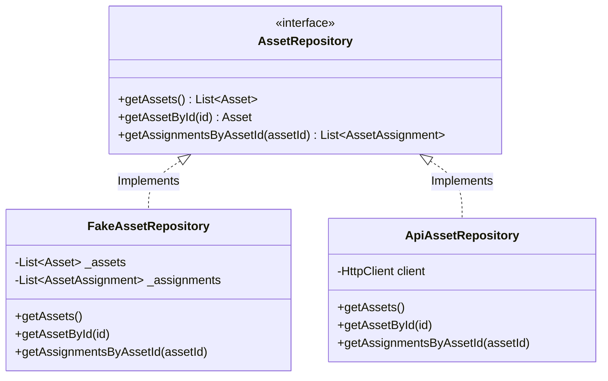

# Tài liệu Kiến trúc Hệ thống (System Architecture)

Tài liệu này mô tả chi tiết cấu trúc thư mục, luồng dữ liệu, mẫu thiết kế (Design Pattern) và định hướng tích hợp backend ASP.NET Core trong tương lai cho ứng dụng **Quản lý Tài sản CNTT & Hỗ trợ kỹ thuật nội bộ**.

---

## 1. Cấu trúc thư mục (Folder Structure)

Dự án được xây dựng dựa trên nguyên lý kiến trúc sạch (Clean Architecture) kết hợp mô hình phân lớp miền nghiệp vụ:

```text
lib/
├── domain/                    # Lớp Nghiệp vụ (Domain Layer) - Không phụ thuộc thư viện ngoài
│   ├── models/                # Thực thể dữ liệu (Asset, SupportTicket, AssetAssignment, v.v.)
│   └── repositories/          # Giao diện quy định chức năng (AssetRepository, SupportRepository, v.v.)
│
├── data/                      # Lớp Dữ liệu (Data Layer) - Triển khai chi tiết truy xuất dữ liệu
│   ├── datasource/            # Nguồn dữ liệu thô
│   │   ├── local/             # Lưu trữ cục bộ (SQLite, Cache, Preferences)
│   │   └── remote/            # Giao thức mạng kết nối máy chủ từ xa
│   └── repositories/          # Cụ thể hóa kho chứa (FakeAssetRepository, ApiAssetRepository, v.v.)
│
├── presentation/              # Lớp Hiển thị & Điều khiển (Presentation Layer)
│   ├── providers/             # Quản lý trạng thái bằng Riverpod (State/Future/Action Providers)
│   └── widgets/               # Các Widget tái sử dụng (AssetCard, EmptyState, v.v.)
│
├── screens/                   # Các màn hình chính (Dashboard, Detail, Scan, Tickets, Profile, v.v.)
├── utils/                     # Hằng số màu sắc, cấu hình ứng dụng (Colors, Theme, v.v.)
└── widgets/                   # Các widget chung của toàn bộ ứng dụng (BottomNav, v.v.)
```

---

## 2. Mẫu thiết kế Kho chứa (Repository Pattern)

Hệ thống phân tách rạch ròi giữa định nghĩa phương thức truy xuất dữ liệu (Interface) và thực thi (Implementation) nhằm tối đa hóa khả năng kiểm thử (Testability) và linh hoạt khi thay đổi nguồn dữ liệu:



### Các Lớp Triển Khai Hiện Tại:
- **Fake Repository (`FakeAssetRepository`, `FakeSupportRepository`)**: Sử dụng bộ nhớ tạm (in-memory mock data) để phát triển nhanh giao diện người dùng và kiểm thử trải nghiệm mà không cần máy chủ thực tế.
- **Api Repository (`ApiAssetRepository`, `ApiSupportRepository`)**: Chứa khung triển khai API (skeleton with TODO) phục vụ cho bước tích hợp thật trong tương lai.

---

## 3. Luồng dữ liệu (Data Flow)

Ứng dụng sử dụng thư viện **Riverpod** làm trung tâm điều phối luồng dữ liệu một chiều (Unidirectional Data Flow):

```text
[Người Dùng] ──(Tương tác/Nhấn nút)──> [Giao Diện UI (Widget/Screen)]
                                                   │
                                            (Đọc trạng thái / Gọi hàm)
                                                   ▼
[Mô hình Domain] <──(Trả dữ liệu)── [Riverpod Providers / Notifiers]
       │                                           │
  (Ánh xạ/Mã hóa)                             (Gọi phương thức)
       │                                           ▼
       └────────────────────────────── [Repository Implementation]
                                                   │
                                            (Đọc/Ghi dữ liệu)
                                                   ▼
                                        [Fake Data / REST API]
```

1. **Truy xuất dữ liệu**: Giao diện UI lắng nghe các `FutureProvider` (Ví dụ: `assetsProvider`). Provider sẽ gọi phương thức từ Repository đã cấu hình và trả về dữ liệu hiển thị tự động.
2. **Cập nhật dữ liệu**: Khi người dùng submit form hoặc nhấn hành động, UI gọi hàm từ `StateNotifier` (Ví dụ: `assetActionProvider.notifier.addAsset(...)`).
3. **Đồng bộ hóa**: Khi hành động lưu thành công, Notifier sử dụng cơ chế `ref.invalidate(...)` để làm mới các provider liên quan, kích hoạt luồng tải lại dữ liệu tự động lên giao diện.

---

## 4. Định hướng tích hợp Backend ASP.NET Core & PostgreSQL

Khi chuyển ứng dụng sang chế độ chạy thực tế (Production Mode), luồng dữ liệu sẽ hoạt động như sau:

### 4.1 Cấu hình Két nối mạng (Remote Datasource)
- Triển khai lớp `ApiClient` sử dụng thư viện `Dio` hoặc `Http` tại `lib/data/datasource/remote/`.
- Cấu hình Interceptor để đính kèm tiêu đề Authorization (Bearer token) lấy từ Local Storage.

### 4.2 Thiết kế API Endpoints (ASP.NET Core)
ApiRepository sẽ kết nối trực tiếp đến các REST API sau:
- **Tài sản (Assets)**:
  - `GET /api/assets` -> Lấy danh sách tài sản.
  - `GET /api/assets/{id}` -> Xem chi tiết tài sản.
  - `POST /api/assets` -> Thêm tài sản mới.
  - `PUT /api/assets/{id}` -> Cập nhật tài sản.
- **Yêu cầu Hỗ trợ (Support Tickets)**:
  - `GET /api/support/tickets` -> Danh sách ticket.
  - `POST /api/support/tickets` -> Tạo yêu cầu hỗ trợ mới.
  - `PATCH /api/support/tickets/{id}/status` -> Thay đổi trạng thái xử lý ticket.

### 4.3 Đồng bộ lưu trữ cục bộ (Local Datasource)
- Tích hợp `sqflite` hoặc `Hive` tại `lib/data/datasource/local/` để lưu trữ ngoại tuyến (offline cache).
- Khi mất kết nối internet, `ApiRepository` có thể đọc dữ liệu trực tiếp từ Local Database và hàng đợi (Queue) các yêu cầu ghi để đồng bộ lại khi khôi phục kết nối.
